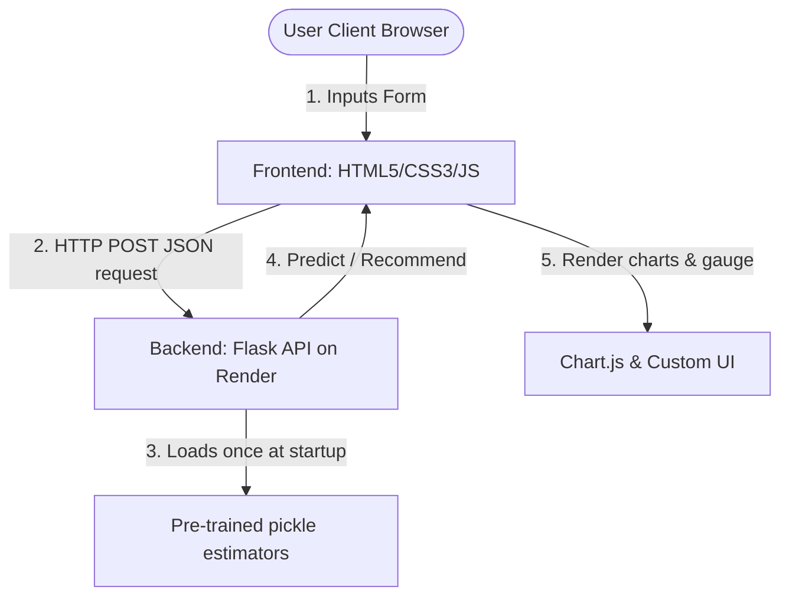

# AI Fitness & Diet Recommendation System

A production-ready Full-Stack Web Application that provides personalized health, calorie, workout, and meal plans using Machine Learning models (Linear Regression, Random Forests, Cosine Similarity, and simulated LSTMs).

The system consists of a modular **Flask API Backend** (trained on a 1000-user dataset) and a premium, responsive **Vanilla HTML5/CSS3/JS Dashboard** featuring glassmorphic designs, micro-animations, and interactive Chart.js visualizations.

---

## 📸 Interface Preview
*(UI utilizes responsive glassmorphic cards, custom metric indicators, and real-time visualization graphs)*
- **Dashboard**: Metric cards, BMI category pointer gauge, macro nutrient distributions, weight history progress logs, and 4-week forecasts.
- **Form Controls**: Customized inputs, slider steps, and real-time client-side inputs validator.

---

## 🏗️ Architecture



The system separates concerns:
1. **Model Pipeline (`backend/train.py`)**: Preprocesses `AI_Fitness_Raw_Dataset.xlsx` (categorical label encoding, NaN cleansing), trains ML estimators, and dumps serialized objects to `backend/models/` (runs once offline or during build).
2. **REST API (`backend/app.py`)**: Startup hooks load models only **once** in-memory. Endpoint `/predict` processes validation schemas and responds with computed metrics in JSON under 100ms.
3. **Web Client (`frontend/`)**: Static client SPA which serves HTML/CSS/JS, charts predictions, handles dynamic API endpoint changes, and stores backend configurations in localStorage.

---

## 📁 Folder Structure

```
fitness/
├── backend/
│   ├── app.py              # Modular Flask REST API
│   ├── train.py            # Model training & preprocessing pipeline
│   ├── Procfile            # Deployment script command for Render
│   ├── requirements.txt    # Production python packages dependencies
│   ├── runtime.txt         # Specified Python compiler version
│   ├── models/             # Serialized joblib pickle artifacts (git-tracked)
│   │   ├── calorie_model.pkl
│   │   ├── workout_model.pkl
│   │   ├── le_gender.pkl
│   │   ├── le_goal.pkl
│   │   ├── le_workout.pkl
│   │   ├── cv.pkl
│   │   ├── df_original.pkl
│   │   ├── lstm_scaler.pkl
│   │   └── weight_history.pkl
│   └── tests/
│       └── test_api.py     # Endpoint and boundary unit tests
├── frontend/
│   ├── index.html          # Dashboard HTML structure
│   ├── style.css           # Premium vanilla dark-mode style stylesheet
│   ├── app.js              # Fetch client, chart.js config, gauge calculator
│   └── vercel.json         # Vercel deployment routes and header overrides
├── dataset/
│   └── AI_Fitness_Raw_Dataset.xlsx # Original Excel training dataset
├── .gitignore              # Ignored caches, environments and temp files
└── README.md               # Professional documentation
```

---

## 🚀 Local Setup & Installation

### Prerequisites
- Python 3.10 or 3.12
- Web browser (Chrome, Edge, Firefox, Safari)

### 1. Backend Setup
Navigate to the root directory and install dependencies:
```bash
# Install backend requirements
pip install -r backend/requirements.txt

# Run model training (optional: models are pre-trained)
python backend/train.py

# Start the Flask API server
python backend/app.py
```
The unified application will run on: **`http://localhost:5000`** (which serves both the frontend client and backend API on the same port out-of-the-box).

### 2. Alternative Split Setup (Optional)
If you want to run them on separate ports to mock independent frontend and backend services:
```bash
# Serve static files from the frontend folder separately
python -m http.server 8000 --directory frontend
```
Navigate to: `http://localhost:8000` and use the Gear Icon in the header to point to the backend at `http://localhost:5000`.

---

## 📡 API Documentation

### POST `/predict`
Submit profile variables to receive personalized calculations.

**Request Headers**:
- `Content-Type: application/json`

**Request Body** (JSON):
```json
{
  "name": "Jane Doe",
  "age": 25,
  "gender": "Female",
  "height": 165,
  "weight": 60,
  "sleep": 8,
  "steps": 12000,
  "workout_hours": 2,
  "goal": "Cut",
  "diet_pref": "High Protein",
  "medical": "None"
}
```

**Response** (JSON - `200 OK`):
```json
{
  "name": "Jane Doe",
  "bmi": 22.04,
  "bmi_status": "Normal Weight",
  "ml_calories": 2185,
  "bmr_calories": 2154,
  "protein_g": 96,
  "carb_g": 269,
  "fat_g": 60,
  "sleep_hours": 8.0,
  "sleep_status": "Good",
  "steps": 12000,
  "workout_hours": 2.0,
  "workout_plan": "Cardio + HIIT",
  "workout_display": "Fat Loss Workout\n- Running\n- HIIT\n- Cycling\n- Jump Rope",
  "meal_plan": "High Protein Meal Plan",
  "diet_display": "Non-Veg Fat Loss Diet\n- Chicken Breast\n- Boiled Eggs\n- Vegetables\n- Soup",
  "warning": "",
  "weight_history": [85.0, 84.0, 83.0, 82.0, 81.0, 80.0, 79.0, 78.0, 77.0, 76.0],
  "lstm_next_weight": 75.12,
  "projection_weeks": ["Start", "Week 1", "Week 2", "Week 3", "Week 4"],
  "projection_weights": [60.0, 59.2, 58.5, 57.6, 57.0]
}
```

### GET `/health`
Check if the API is operational and models are active.
- **Response**: `{"status": "healthy", "models_loaded": true}`

---

## 🛠️ Testing

Unit tests cover the Flask routing, schema restrictions, and model predictions.
Run tests locally:
```bash
cd backend
python -m unittest tests/test_api.py
```

---

## 🚀 Future Enhancements
- **Dynamic Weight Logs**: Allow users to append weight values to the database to train the LSTM on their personal trends.
- **Diet/Workout Modifiers**: Introduce allergen parameters or custom routine selections.
- **User Authentication**: Secure individual metrics behind user accounts.
